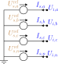

# Voltage sources

A **voltage source** is an ideal voltage reference with a current slack: it fixes the
bus terminal voltages and injects whatever current the rest of the network requires.
It is the power-flow reference (slack) bus. This model version permits exactly one.
Symbols are defined in [Notation](notation.md).



## 1. Data model

A voltage source is an entry of the top-level `voltage_source` object, keyed by its
string ID $s$.

| Field | Type | Unit | Req. | Description |
|-------|------|:----:|:----:|-------------|
| `bus` | string | – | ✔ | Host bus ID $i$ |
| `terminal_map` | string[] | – | ✔ | Conductor→terminal map $\textcolor{purple}{\mathbf{N}_{s}}$ (phase terminals) |
| `v_magnitude` | number[] | V | ✔ | Per-terminal voltage magnitude |
| `v_angle` | number[] | rad | ✔ | Per-terminal voltage angle |
| `cost` | number[] | \$/kWh | ✔ | Per-phase linear dispatch cost |

## 2. Input symbols

| Field | Symbol | Notes |
|-------|:------:|-------|
| `v_magnitude` | $\textcolor{red}{\lvert\mathbf{U}^{s}_{s}\rvert}$ | per terminal |
| `v_angle` | $\textcolor{red}{\boldsymbol{\theta}^{s}_{s}}$ | per terminal |
| `cost` | $\textcolor{red}{\mathbf{c}_{s}}$ | per phase |

## 3. Variables

The source injects a **slack current** $\textcolor{blue}{I_{s,k}}$ per phase terminal,
stacked into $\textcolor{blue}{\mathbf{I}_{s}}$. It is otherwise unconstrained — it
absorbs whatever power balance the network requires, which is what makes this the
reference bus.

## 4. Equality constraints

### Fixed reference voltage

Each phase terminal is fixed to its polar reference, and the source-bus neutral to
ground:

```math
\textcolor{blue}{U_{i,p}} = \textcolor{red}{|U^{s}_{s,p}|}\,\textcolor{brown}{\angle}\,\textcolor{red}{\theta^{s}_{s,p}},
\qquad
\textcolor{blue}{U_{i,n}} = 0.
```

### Slack current injection

The slack current enters KCL at the phase terminals, with its return at the neutral:
$+\textcolor{blue}{I_{s,k}}$ at phase $t_k$, and $-\sum_k\textcolor{blue}{I_{s,k}}$ at
the neutral.

### Injected power

The complex power injected at phase terminal $p$ is

```math
\textcolor{blue}{S_{s,p}} = \textcolor{blue}{U_{i,p}}\,(\textcolor{blue}{I_{s,p}})^{*}
= P_{s,p} + \textcolor{brown}{j}\,Q_{s,p}.
```

The [Objective](objective.md) multiplies $P_{s,p}$ by the per-phase `cost` field
to compute this source's contribution to total dispatch cost.

## 5. Inequality constraints

### Cartesian variable bounds

**None** — the slack current is free.

### Engineering bounds

**None (foundational).** A pure slack has no rating.
