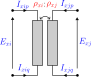
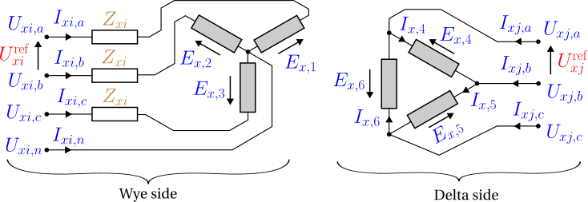

# Transformers

A **transformer** couples two buses through **galvanically isolated** windings —
primary and secondary share no conductor, only magnetic flux. Because the winding
topologies differ qualitatively, each configuration is a distinct data-model object:
`single_phase`, `center_tap`, `wye_delta`, and `delta_wye`. Every model is built from an
idealised winding pair plus a series leakage impedance; a magnetising shunt, internal
neutral grounding, and tap-changing are not yet modelled (see
[Background & scope](scope.md)). Symbols are defined in [Notation](notation.md).

## 1. Data model

Each subtype is an entry under `transformer.<subtype>`, keyed by its string ID $x$.
Common fields (two-winding subtypes):

| Field | Type | Unit | Req. | Description |
|-------|------|:----:|:----:|-------------|
| `bus_from`, `bus_to` | string | – | ✔ | Endpoint bus IDs $i$, $j$ |
| `terminal_map_from`, `terminal_map_to` | string[] | – | ✔ | Conductor→terminal maps (lengths per subtype) |
| `v_nom_from`, `v_nom_to` | number | V | ✔ | Nominal winding voltages — set the turns ratio |
| `s_rating` | number | VA | ✔ | Nameplate apparent-power rating |
| `r_series_from`, `x_series_from` | number | Ω | | From-winding series leakage (`single_phase`, `center_tap`) |
| `r_series_to`, `x_series_to` | number | Ω | | To-winding series leakage (`single_phase`, `center_tap`) |
| `r_series`, `x_series` | number | Ω | | Series leakage, wye winding only (`wye_delta`, `delta_wye`) |
| `i_max_from`, `i_max_to` | number[] | A | | Per-conductor current limits |

Terminal-map lengths: `single_phase` 2 + 2; `center_tap` 2 (from) + 3 (to, ordered
L1/centre/L2); `wye_delta` 4 (wye) + 3 (delta); `delta_wye` 3 (delta) + 4 (wye). For
`center_tap`, `v_nom_to` is the **half-winding** (leg) voltage — e.g. 120 V for a
240/120 V service — not the full secondary span.

## 2. Input symbols

| Field | Symbol | Notes |
|-------|:------:|-------|
| `v_nom_from`, `v_nom_to` | $\textcolor{red}{U^{\text{nom}}_i},\ \textcolor{red}{U^{\text{nom}}_j}$ | turns ratio $\textcolor{red}{N}=\textcolor{red}{U^{\text{nom}}_i}/\textcolor{red}{U^{\text{nom}}_j}$ |
| `r/x_series_from` | $\textcolor{brown}{Z^{\text{fr}}_x}=\textcolor{red}{R^{\text{fr}}_x}+\textcolor{brown}{j}\textcolor{red}{X^{\text{fr}}_x}$ | from-winding leakage |
| `r/x_series_to` | $\textcolor{brown}{Z^{\text{to}}_x}=\textcolor{red}{R^{\text{to}}_x}+\textcolor{brown}{j}\textcolor{red}{X^{\text{to}}_x}$ | to-winding leakage |
| `r_series`, `x_series` | $\textcolor{brown}{Z^{\text{wye}}_x}=\textcolor{red}{R^{\text{wye}}_x}+\textcolor{brown}{j}\textcolor{red}{X^{\text{wye}}_x}$ | wye-side leakage (`wye_delta`/`delta_wye`) |
| `s_rating` | $\textcolor{red}{S^{\max}_x}$ | nameplate |

## 3. Variables

Each winding conductor $k$ on side $\sigma\in\{\text{fr},\text{to}\}$ carries a complex
winding current $\textcolor{blue}{I_{x,\sigma,k}}$. For the winding spanning terminal
pair $(p_k,q_k)$ on bus $b^\sigma$, write the **winding voltage**

```math
\textcolor{blue}{V^{\sigma}_{x,k}} = \textcolor{blue}{U_{b^\sigma,p_k}} - \textcolor{blue}{U_{b^\sigma,q_k}}
```

(phase-to-neutral for a wye winding, line-to-line for a delta winding, with
$\textcolor{blue}{U}=0$ when $q_k$ is absent/ground).

## 4. Equality constraints

### The idealised winding pair

Every transformer is built from **ideal winding pairs** obeying flux linkage, complex-
power conservation, and winding KCL. With winding EMFs $\textcolor{blue}{E^{\text{fr}}_x},\textcolor{blue}{E^{\text{to}}_x}$
and the nominal voltages standing in for the turns ratio:



```math
\frac{\textcolor{blue}{E^{\text{fr}}_x}}{\textcolor{red}{U^{\text{nom}}_i}} = \frac{\textcolor{blue}{E^{\text{to}}_x}}{\textcolor{red}{U^{\text{nom}}_j}},
\qquad
\textcolor{red}{U^{\text{nom}}_i}\,\textcolor{blue}{I_{x,\text{fr}}} + \textcolor{red}{U^{\text{nom}}_j}\,\textcolor{blue}{I_{x,\text{to}}} = 0
\ \Longleftrightarrow\
\textcolor{red}{N}\,\textcolor{blue}{I_{x,\text{fr}}} + \textcolor{blue}{I_{x,\text{to}}} = 0.
```

The second relation is the **ampere-turn balance**; with all losses removed the EMF is
the terminal voltage and $\textcolor{blue}{V^{\text{fr}}_x} = \textcolor{red}{N}\,\textcolor{blue}{V^{\text{to}}_x}$.

### Series leakage

Each winding carries a series impedance between its EMF and its terminals (Ohm's law)
— the model's one loss element, representing copper/leakage loss. Referred to the HV
(from) side and combined,
$\textcolor{brown}{Z_x}=\textcolor{brown}{Z^{\text{fr}}_x}+\textcolor{red}{N}^2\,\textcolor{brown}{Z^{\text{to}}_x}$,
the ideal voltage relation becomes

```math
\textcolor{blue}{V^{\text{fr}}_x} - \textcolor{red}{N}\,\textcolor{blue}{V^{\text{to}}_x} = \textcolor{brown}{Z_x}\,\textcolor{blue}{I_{x,\text{fr}}}.
```

This combined $\textcolor{brown}{Z_x}$ is what a short-circuit test measures — the
*series sum* of the two winding leakages, referred to one side; it is not itself a
separate element. `single_phase` and `center_tap` keep the two leakages as separate
fields, `r/x_series_from` → $\textcolor{brown}{Z^{\text{fr}}_x}$ and `r/x_series_to` →
$\textcolor{brown}{Z^{\text{to}}_x}$; `wye_delta` and `delta_wye` instead give a single
`r_series`/`x_series` → $\textcolor{brown}{Z^{\text{wye}}_x}$ on the wye winding only
(the delta winding is lossless in this model).

!!! note "The per-winding leakage split is under-determined by a short-circuit test"
    A standard short-circuit test yields only $\textcolor{brown}{Z_x}$ — the *sum* of
    the two winding leakages. Splitting it into $\textcolor{brown}{Z^{\text{fr}}_x}$
    and $\textcolor{brown}{Z^{\text{to}}_x}$ requires an extra convention (OpenDSS
    splits per its winding definitions; a common default is to put it all on one
    winding, i.e. the Γ-model with the other winding's leakage zero). The data model
    exposes both fields so the convention is explicit rather than assumed.

The subtypes below place this leakage differently: single-phase and centre-tap keep it
split across both windings; wye–delta / delta–wye lump it entirely on the wye side.

### Single-phase

One winding pair — the archetypal two-winding transformer. With the combined leakage
$\textcolor{brown}{Z_x}=\textcolor{brown}{Z^{\text{fr}}_x}+\textcolor{red}{N}^2\textcolor{brown}{Z^{\text{to}}_x}$
(see [Series leakage](#Series-leakage) above):

```math
\textcolor{blue}{V^{\text{fr}}_{x,k}} - \textcolor{red}{N}\,\textcolor{blue}{V^{\text{to}}_{x,k}} = \textcolor{brown}{Z_x}\,\textcolor{blue}{I_{x,\text{fr},k}},
\qquad
\textcolor{red}{N}\,\textcolor{blue}{I_{x,\text{fr},k}} + \textcolor{blue}{I_{x,\text{to},k}} = 0.
```

### Center-tap (split-phase)

One HV winding drives **two anti-series LV legs** sharing a centre-tap neutral: two
from terminals $[p,q]$, three to terminals $[p,n,q]$ (L1, centre, L2). The two
half-windings are tightly coupled, so the model is a genuine three-winding
(coupled-coil) unit, not two independent legs.


KCL at each side:

```math
\textcolor{blue}{I_{x,\text{fr},p}}+\textcolor{blue}{I_{x,\text{fr},q}}=0,
\qquad
\textcolor{blue}{I_{x,\text{to},p}}+\textcolor{blue}{I_{x,\text{to},n}}+\textcolor{blue}{I_{x,\text{to},q}}=0.
```

Each winding EMF follows Ohm's law from its terminal voltage. The lower leg's dotted
terminal is the centre tap $n$, not $q$, so its EMF runs from $n$ toward $q$:

```math
\textcolor{blue}{E^{\text{fr}}_x} = (\textcolor{blue}{U_{i,p}}-\textcolor{brown}{Z^{\text{fr}}_x}\,\textcolor{blue}{I_{x,\text{fr},p}})-\textcolor{blue}{U_{i,q}},
\qquad
\textcolor{blue}{E^{\text{to}}_{x,p}} = (\textcolor{blue}{U_{j,p}}-\textcolor{brown}{Z^{\text{to}}_x}\,\textcolor{blue}{I_{x,\text{to},p}})-\textcolor{blue}{U_{j,n}},
```

```math
\textcolor{blue}{E^{\text{to}}_{x,q}} = (\textcolor{blue}{U_{j,n}}-\textcolor{brown}{Z^{\text{to}}_x}\,\textcolor{blue}{I_{x,\text{to},q}})-\textcolor{blue}{U_{j,q}}.
```

with flux linkage and ampere-turn balance across all three ports:

```math
\frac{\textcolor{blue}{E^{\text{fr}}_x}}{\textcolor{red}{U^{\text{nom}}_i}} = \frac{\textcolor{blue}{E^{\text{to}}_{x,p}}}{\textcolor{red}{U^{\text{nom}}_j}} = \frac{\textcolor{blue}{E^{\text{to}}_{x,q}}}{\textcolor{red}{U^{\text{nom}}_j}},
\qquad
\textcolor{red}{U^{\text{nom}}_i}\,\textcolor{blue}{I_{x,\text{fr},p}} + \textcolor{red}{U^{\text{nom}}_j}\,\textcolor{blue}{I_{x,\text{to},p}} + \textcolor{red}{U^{\text{nom}}_j}\,\textcolor{blue}{I_{x,\text{to},q}} = 0.
```

The centre-tap current
$\textcolor{blue}{I_{x,\text{to},n}}=-(\textcolor{blue}{I_{x,\text{to},p}}+\textcolor{blue}{I_{x,\text{to},q}})$
is the leg-imbalance current; whether and how it is grounded is external to the
transformer (see [Grounding](grounding.md)).

### Wye–delta and delta–wye

Three winding pairs. The delta connection introduces a $\sqrt{3}$ factor, so the
per-winding ratio is



```math
\textcolor{red}{n^{\text{eff}}} =
\begin{cases}
\sqrt{3}/\textcolor{red}{N} & \text{wye\_delta (wye is from)},\\
\textcolor{red}{N}\,\sqrt{3} & \text{delta\_wye (delta is from)}.
\end{cases}
```

For phase $k$ with cyclic partner $k'$ (next for Yd, previous for Dy), the delta
line-to-line voltage equals $\textcolor{red}{n^{\text{eff}}}$ times the wye
phase-to-neutral voltage, less the series drop on the wye phase current
$\textcolor{blue}{I_{x,\text{wye},k}}$ through the wye-side leakage
$\textcolor{brown}{Z^{\text{wye}}_x}$ (the delta winding is lossless):

```math
\textcolor{blue}{U_{\text{del},k}} - \textcolor{blue}{U_{\text{del},k'}}
= \textcolor{red}{n^{\text{eff}}}\big(\textcolor{blue}{U_{\text{wye},k}} - \textcolor{blue}{U_{\text{wye},n}}\big)
- \textcolor{red}{n^{\text{eff}}}\,\textcolor{brown}{Z^{\text{wye}}_x}\,\textcolor{blue}{I_{x,\text{wye},k}}.
```

The current transform is the transpose (power-conservative),
$\textcolor{red}{n^{\text{eff}}}\,\textcolor{blue}{I_{x,\text{del},k}} = -(\textcolor{blue}{I_{x,\text{wye},k}}-\textcolor{blue}{I_{x,\text{wye},k'}})$,
and the wye star point satisfies
$\textcolor{blue}{I_{x,\text{wye},n}}+\sum_k\textcolor{blue}{I_{x,\text{wye},k}}=0$.
Whether the wye neutral is grounded is external to the transformer (see
[Grounding](grounding.md)).

## 5. Inequality constraints

### Cartesian variable bounds

Optional per-conductor current boxes on the winding-current components, from
`i_max_from`/`i_max_to` — implied by the current circles below.

### Engineering bounds

**Per-winding current-magnitude circles**, per conductor $k$ and side $\sigma$:

```math
\textcolor{blue}{I_{x,\sigma,k}}\,(\textcolor{blue}{I_{x,\sigma,k}})^{*} \le (\textcolor{red}{I^{\max}_{x,\sigma,k}})^2.
```

**Nameplate power.** The winding-pair power transfer is bounded by the rating,
$|\textcolor{blue}{E^{\text{fr}}_x}\,(\textcolor{blue}{I_{x,\text{fr}}})^{*}| \le \textcolor{red}{S^{\max}_x}/\textcolor{red}{n_x}$
with $\textcolor{red}{n_x}$ the number of winding pairs (1 single-phase, 3 three-phase;
centre-tap uses 1 on the from winding and 2 on the to legs).
